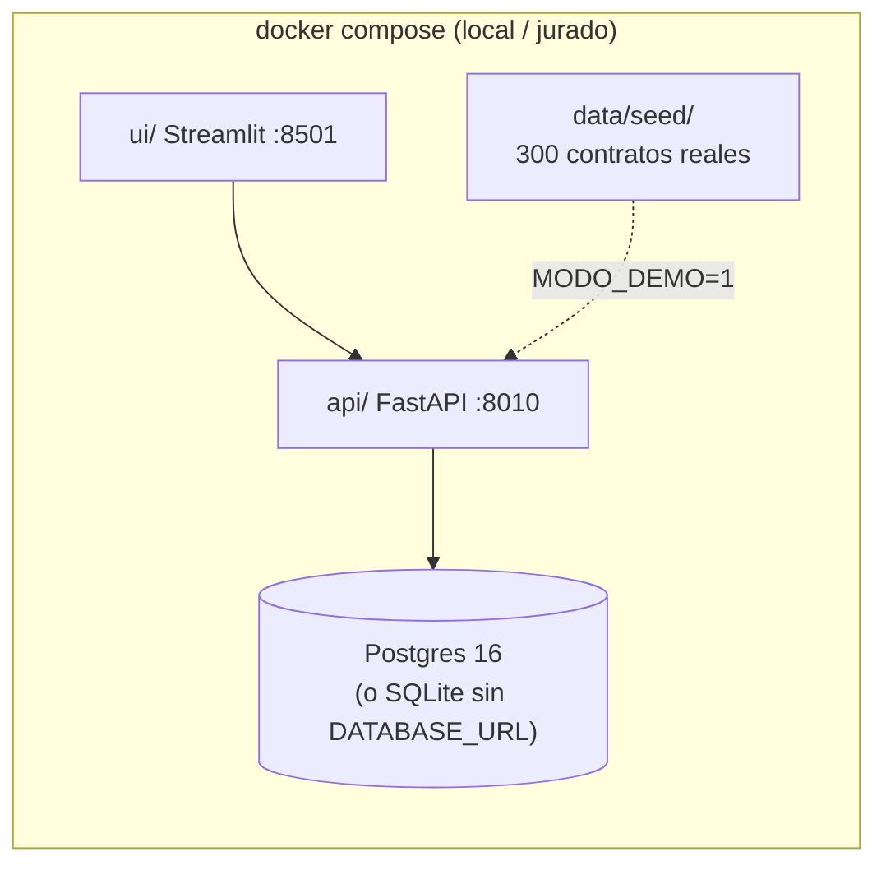
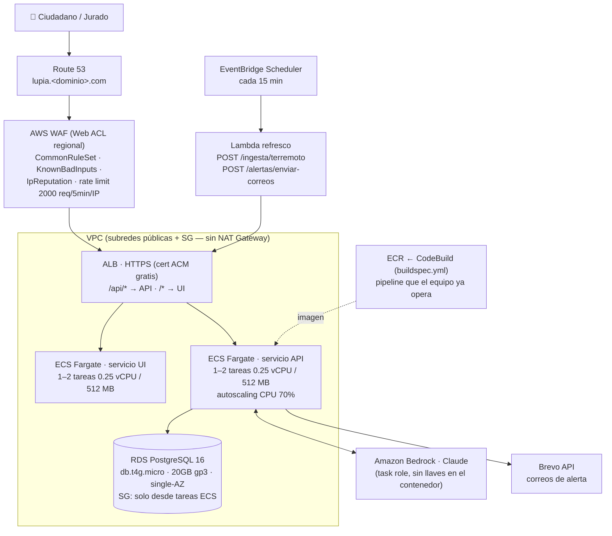
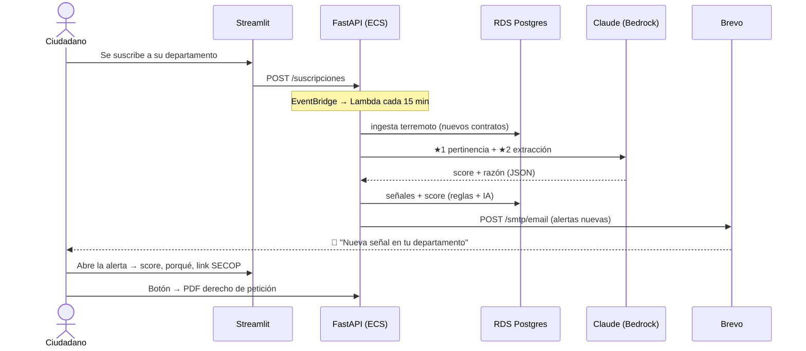

# LupIA — Arquitectura

> **Decisión:** demo desplegado "en serio" en AWS — WAF + ALB + ECS Fargate + RDS PostgreSQL —
> pero con los recursos más chicos de cada servicio. Costo del fin de semana: **~USD 4–5**.
> En local todo corre igual con `docker compose up` (Postgres incluido) y hay **modo demo
> sin llaves** con seed para la rúbrica "el MVP corre".

## 1. Desarrollo local (idéntico al repo que evalúa el jurado)

`docker compose up` levanta **Postgres 16 + API (FastAPI) + UI (Streamlit)**. Sin `.env`
arranca en modo demo con el seed (300 contratos reales de muestra). El motor es dual:
`DATABASE_URL` vacío → SQLite; con URL de Postgres → Postgres. Mismo código, cero cambios.



## 2. Demo escalable en AWS (lo que se despliega el sábado en la noche)



**Decisiones y por qué:**

| Pieza | Elección | Por qué / truco de costo |
|---|---|---|
| Cómputo | **ECS Fargate** 0.25 vCPU / 512 MB, 1–2 tareas por servicio | Sin servidores que administrar; el equipo ya opera ECS+ECR+CodeBuild en producción. Autoscaling = argumento real de escala para el jurado |
| Red | Tareas en **subred pública** con IP pública + Security Group cerrado (solo ALB) | **Evita el NAT Gateway**, el costo escondido de Fargate ($0.045/h + $/GB ≈ USD 32/mes) |
| Base | **RDS PostgreSQL db.t4g.micro** single-AZ, 20 GB gp3 | La más chica que existe (~$0.016/h). Free tier 750 h/mes si la cuenta aplica. Multi-AZ y réplicas = roadmap |
| Seguridad | **WAF** con 3 reglas administradas + rate-based rule | Protege el free tier ciudadano y el gasto de LLM del abuso. Prorrateado por horas: centavos en el finde |
| HTTPS | **ACM** (gratis) + subdominio en Route 53 | URL seria para el README; probar desde celular con datos móviles |
| IA | **Bedrock** vía task role (`bedrock:InvokeModel`) | Cero llaves dentro del contenedor |
| Correos | **Brevo** (no SES) | Sin sandbox: el correo del video llega a cualquier celular ya |
| Refresco | **EventBridge → Lambda** que llama a la API | "Monitor en tiempo real" de verdad; 10 líneas de Lambda, patrón que ya conocen de hurclick_serveless |

**Costos (us-east-1, aprox):**

| Recurso | Tarifa | Fin de semana (48 h) | Mes completo |
|---|---|---|---|
| ALB | $0.0225/h + LCU | ~$1.30 | ~$18 |
| WAF (ACL + 4 reglas + tráfico) | prorrateado/h | ~$0.60 | ~$9 |
| Fargate (3 tareas 0.25/0.5) | $0.012/h c/u | ~$1.70 | ~$26 |
| RDS db.t4g.micro + 20GB | $0.016/h + $2.3/mes | ~$0.90 | ~$14 (o $0 free tier) |
| Bedrock (Claude) | por consumo | ~$1–2 | según uso |
| **Total** | | **~USD 4–6** | **~USD 55–70** |

> Para recortar aún más después de la premiación: bajar a 1 tarea por servicio, parar RDS
> (se puede detener 7 días), o volver al compose en una sola EC2.

## 3. Flujo de la alerta (el momento del video: el correo llegando)



## 4. Roadmap (se cuenta, no se construye)

La evolución natural cuando crezca el volumen (SECOP I + regalías, todo el país):

- **Ingesta serverless**: EventBridge → Lambda ingesta → SQS → Lambda señales → SQS →
  Lambda notificador (desacopla picos; patrón ya operado por el equipo).
- **Aurora Serverless v2** en vez de RDS micro cuando haya usuarios concurrentes reales.
- **CloudFront** delante del ALB para cachear la UI y el dataset abierto en S3.
- **Haiku** para clasificación masiva (centavos por miles de contratos), Opus para el chat.
- Alertas de vuelta como **dataset abierto** (S3 + API pública con cupo).

## 5. Orden de despliegue (bloque 23:00–01:00 del cronograma)

```bash
# 0. Ya validado local: docker compose up (Postgres + API + UI)
# 1. RDS: db.t4g.micro, PG16, single-AZ, SG "lupia-db" (5432 solo desde SG "lupia-svc")
# 2. ECR: crear repo lupia; docker build + push (o CodeBuild con buildspec)
# 3. ECS: cluster Fargate + 2 servicios (api, ui) con SG "lupia-svc", subred pública,
#    task role con bedrock:InvokeModel. Variables: DATABASE_URL, BREVO_API_KEY, SODA_APP_TOKEN
# 4. ALB + target groups (api:8010 /api/*, ui:8501 /*) + cert ACM + Route 53
# 5. WAF: Web ACL regional -> asociar al ALB (Common, KnownBadInputs, IpReputation, rate 2000)
# 6. Lambda refresco + EventBridge Scheduler (rate 15 minutes)
# 7. python scripts/ingesta_completa.py apuntando a RDS (o POST /ingesta/terremoto)
```
